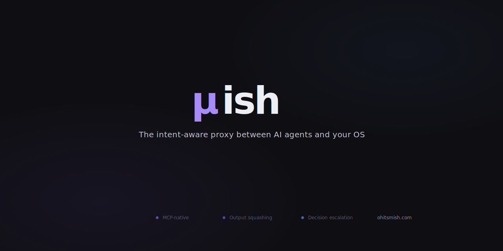

<p align="center">
  
</p>

<p align="center">
  <strong>LLM-native shell.</strong> One binary. Two interfaces. Zero noise.
</p>

---

mish sits between the shell and its caller — whether that's an LLM agent, a human developer, or both — and returns structured, context-efficient responses. It categorizes every command and applies the right handler: condensing verbose output, narrating silent operations, parsing structured data, and warning about dangerous commands. Pure heuristics, no LLM in the loop.

## The problem

LLMs interact with the shell through a Bash tool. The interface is lossy in both directions:

- **Verbose commands** (npm install, cargo build) dump hundreds of lines into context where the signal is one line
- **Silent commands** (cp, mkdir, chmod) return nothing — no confirmation of what happened
- **Dangerous commands** (rm -rf, force push) execute without guardrails
- **Interactive commands** (vim, psql) break the non-interactive tool model

## Before / After

```
Before:  LLM → Bash("npm install")       → 1400 lines raw output
After:   LLM → mish("npm install")       → "1400 lines → exit 0  + 147 packages"

Before:  LLM → Bash("cp file backup/")   → "" (nothing)
After:   LLM → mish("cp file backup/")   → "→ cp: file → backup/ (4.2KB)"

Before:  LLM → Bash("rm -rf node_modules") → "" (nothing, 312MB gone)
After:   LLM → mish("rm -rf node_modules") → "⚠ rm -rf: node_modules/ (47K files, 312MB) — destructive"
```

## Two modes

**CLI proxy** (`mish <command>`) — wraps individual commands with category-aware output. Works with any LLM tool today, or standalone for humans who want cleaner terminal output.

**MCP server** (`mish serve`) — a full process supervisor over JSON-RPC. Manages concurrent PTY sessions, provides ambient process state on every response, detects when processes need input, and hands off to human operators for authentication. Built for LLM agents that need temporal control over long-running processes.

| Category | Commands | Behavior |
|----------|----------|----------|
| Condense | npm, cargo, docker, make, pytest | PTY capture → squash → condensed summary |
| Narrate | cp, mv, mkdir, rm, chmod | Inspect → execute → narrate what happened |
| Passthrough | cat, grep, ls, jq, diff | Output verbatim + metadata footer |
| Structured | git status, docker ps | Machine-readable parse → condensed view |
| Interactive | vim, htop, psql, node REPL | Transparent passthrough |
| Dangerous | rm -rf, force push, reset --hard | Warn before executing |

## Status

Active development. Core pipeline (squasher, classifier, category router, error enrichment) is implemented with 600+ tests. MCP server mode tools are wired. Not yet packaged for distribution.

## License

[MIT](LICENSE)
