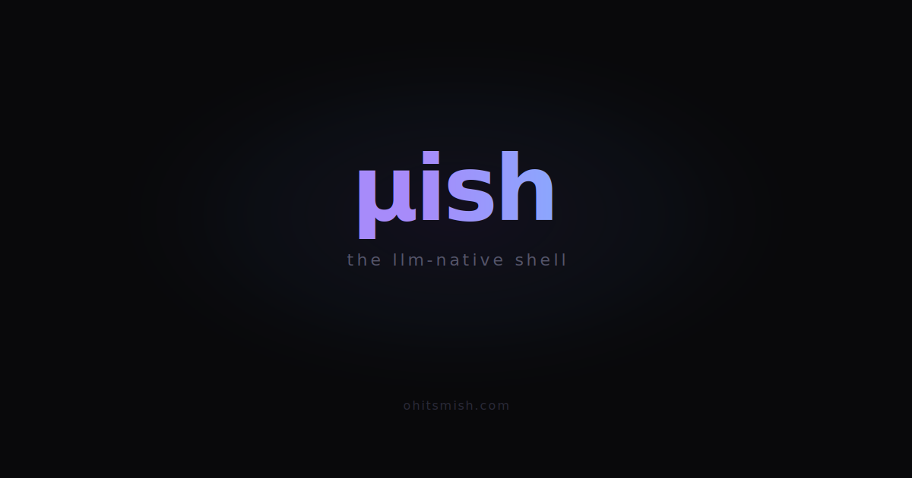

<p align="center">
  
</p>

<p align="center">
  <strong>Five MCP tools between your agent and the OS.</strong><br>
  Structured output · error diagnostics · process control · one binary
</p>

<p align="center">
  <a href="https://ohitsmish.com">ohitsmish.com</a> · <a href="https://github.com/aetherwing-io/mish/releases">Releases</a> · <a href="docs/ARCHITECTURE.md">Architecture</a> · <a href="docs/SHOWCASE.md">Benchmarks</a>
</p>

---

```
Before:  agent → Bash("cargo test")        → 1,319 lines raw output
After:   agent → sh_run("cargo test")      → 201 lines (6.6× reduction)

Before:  agent → Bash("cargo test") + watch → 1,319 lines raw output
After:   agent → sh_run watch="warning"     → 3 lines (440× reduction)

Before:  agent → Bash("cp missing dest/")  → "No such file" + 4 follow-up calls
After:   agent → sh_run("cp missing dest/") → error + path walk + permissions + nearest dirs
```

## Install

```bash
# macOS (Apple Silicon + Intel) and Linux
curl -fsSL https://ohitsmish.com/install.sh | sh

# or from source
cargo install --git https://github.com/aetherwing-io/mish
```

## Connect

```bash
# Claude Code
claude mcp add mish -- mish serve

# Cursor / Windsurf / any MCP client — add to your config:
"mish": { "command": "mish", "args": ["serve"] }
```

Restart your client. Five tools appear:

| Tool | What it does |
|------|-------------|
| **sh_run** | Run a command. Output is squashed, categorized, and enriched with diagnostics on failure. |
| **sh_spawn** | Start a background process. Wait-for-ready patterns, aliases, output spools. |
| **sh_interact** | Send input, read tail, signal, or kill a running process. |
| **sh_session** | Named PTY sessions with full lifecycle control. |
| **sh_help** | Self-documenting reference card. Your agent reads it, never needs a manual. |

## What it does

mish sits between the shell and its caller — whether that's an LLM agent, a human, or both — and returns structured, context-efficient responses. It categorizes every command and applies the right handler. Pure heuristics, no LLM in the loop. Every response includes exit code, timing, and command category. On failure, mish pre-walks paths, checks permissions, and lists nearby files — before your agent has to ask.

### Command routing

Every command is classified into one of six categories:

| Category | Commands | Behavior |
|----------|----------|----------|
| **Condense** | npm, cargo, docker, make, pytest | PTY capture → ANSI strip → dedup → Oreo truncation |
| **Narrate** | cp, mv, mkdir, rm, chmod | Inspect → execute → narrate what happened |
| **Passthrough** | cat, grep, ls, jq, diff | Output verbatim + metadata |
| **Structured** | git status, docker ps | Machine-readable parse |
| **Interactive** | vim, htop, psql, node REPL | Transparent passthrough with raw mode detection |
| **Dangerous** | rm -rf, force push, reset --hard | Warn before executing |

## Benchmarks

Same commands, same machine, same session. mish vs bare shell on a real Rust codebase.

| Scenario | Reduction | How |
|----------|-----------|-----|
| Full test suite | **6.6×** | Dedup + Oreo truncation — head and tail kept, repetitive middle dropped |
| Test suite + watch | **440×** | Only regex-matched lines return |
| Failed command | **5→1 round trips** | Path walks, permissions, nearest dirs — pre-fetched on failure |

Full benchmark data: [SHOWCASE.md](docs/SHOWCASE.md)

## How it works

mish is one binary with two interfaces:

**MCP server** (`mish serve`) — a process supervisor over JSON-RPC with ambient process state on every response, watch patterns for regex filtering, and operator handoff for auth/MFA.

**CLI proxy** (`mish <command>`) — wraps individual commands with category-aware structured output. Works standalone or with any LLM tool.

Both share the same core: category router → squasher pipeline (VTE parse, progress removal, dedup, Oreo truncation) → error enrichment → grammar system (TOML tool grammars with dialect support).

See [ARCHITECTURE.md](docs/ARCHITECTURE.md) for the full execution model.

## Status

Active development. 1,400+ tests across unit, integration, CLI, grammar, fixture, and MCP layers. MCP server is live and battle-tested in daily use with Claude Code. macOS and Linux.

## License

[MIT](LICENSE)
